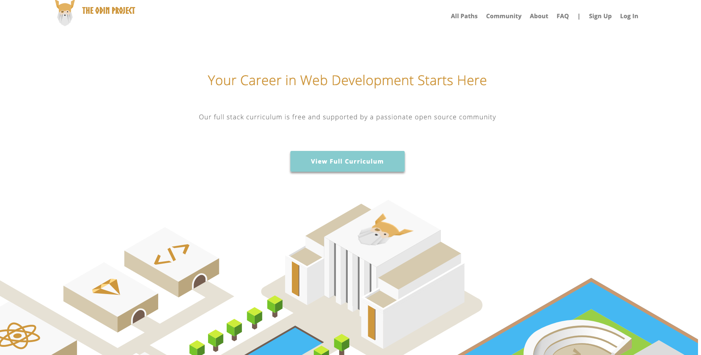

# The Odin Project HTML & CSS Final Assignment

## Creating a Grid Based Layout Framework using SaSS

This is the final and the `boss` challenge of The Odin Project's HTML&CSS project . 
Actually this assignment is a two step one :

A) So far you used Bootstrap, Tailwind, Materialize etc, how about you come up with a framework (extremely minimal, of course) than can be repeteadly used? And hey,may it be a grid-based one. So the users can enjoy the might of the CSS grid.
The best practice is actually 7-1 encapsulation. Creating partial Scss files and storing them accordingly and using by importing. However, due to some problems I encountered with my IDE while I opted for single-file solution. You can find it at the top section of my [style.scss](scss/style.scss) file.

B) Okay, the framework is done, at least in theory. But what about its usability in practice? The image of `The Odin Project` webpage at the top of the Readme is actually a screenshot from this very repository which uses the framework which is the outcome of the assignment.
Thus, in theory and practice, I could manage to come up with a grid based CSS framework from scratch and could deploy it when producing the clone of the Odin webpage.

here is a code snippet from the `Gridme` generator

`
@mixin grid_max($column, $marg){
    display: inline-block;
    width: ((100% - (($column - 1) * $marg)) / $column);
    margin-right: $marg;
    margin-bottom: $marg;
    &:nth-child(#{$column}n){
        margin-right: 0;
    }
}` 